# 🐿 야생동물 상생 플랫폼, 모이다 🦩

# 1. 서비스 소개
## 📅 진행 기간
    - 2023.02.28 ~ 2023.04.07
   
## 🐾 서비스 개요
### 기획 배경
겨울철, 철새는 볍씨를 먹기 위해 하늘을 날라다닙니다. 볍씨가 바닥에 많이 떨어져 있지 않아 민가에 침입하게 되고 조류독감을 전파하는 원인이 됩니다. 야생동물과의 상생을 위한 기부를 받고 봉사를 신청받아 생태계 종 순환에 도움이 되고자 프로젝트를 기획하게 되었습니다. 
   
   
## 🖥 주요 기능
   
### 블록 체인을 활용한 기부  
> 1) 사용자는 기부를 하고 시스템은 해당 기부에 대해 트랜젝션을 생성하고 서명을 진행해 이더리움 네트워크에 전송하여 블록에 거래 정보를 저장합니다.
> 2) 기부를 통해 보상(NFT)을 가질 수 있는 티켓을 발급받습니다.
### 봉사
> 사용자는 봉사를 신청합니다. 프로젝트 별 모금된 기부금액을 모이를 구매하는 데에 사용하고 해당 모이를 야생에 뿌려주는 봉사자를 모집합니다. 봉사를 진행한 후에는 사용자 인증글을 작성할 수 있습니다.
### 보상(NFT)
> 사용자 고유의 정보가 담긴 대체 불가능한 토큰(NFT)를 발급하여 기부의 따뜻함과 함께 특별한 추억을 선물합니다.

   
# 2. 기술 스택
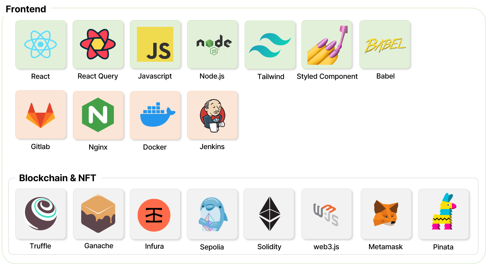
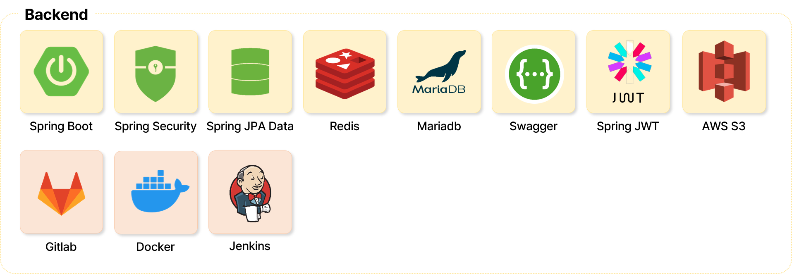
### Front-end
- **VSCode IDE** : v 1.77.0

- **React** : v 18.2.0
- **React-query** : v 4.28.0
- **React Web3** : v 1.9.0
- **Axios** : v 1.3.4
- **Styled-components** : v 5.3.8
- **Tailwind** : v 1.1.7
- **twin** : v 3.1.0
- **Node.js** : v 18.15.0

  
### Back-end
- **IntelliJ IDEA** : v 2022.03

- **Springboot** : v 3.0.4
- **JDK** : v 17.0.6
- **Spring Security** : v 3.0.4
- **JWT** : v 0.11.5
- **JPA** : v 3.0.4
- **Swagger** :  v 3.0.0
- **MariaDB** : v 10.11.2
- **Redis** : v 7.0.10
- **S3** : v 2.2.6

  
### Smart Contract(Blockchain, NFT)
- **Truffle** : v 5.8.1

- **Ganache** : v 7.7.7
- **Truffle Web3** : v 1.8.2
- **Solidity** : v 0.8.19
- **Metamask** : v 10.27.0
   
  
### CI/CD
- **AWS EC2**

- **AWS S3**
- **NGINX**
- **Docker**
- **Jenkins**
- **GitLab**

   
## 3. 서비스 설계🛠
### ERD
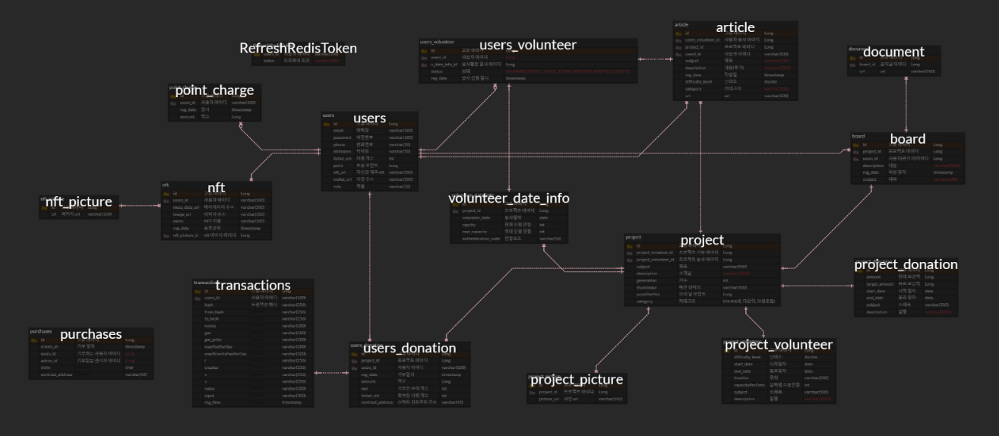  
ERD 자세히 보기: [ERD LINK](https://www.erdcloud.com/d/qCT6HGbna3J9auCnr)
  

### 기능 명세서
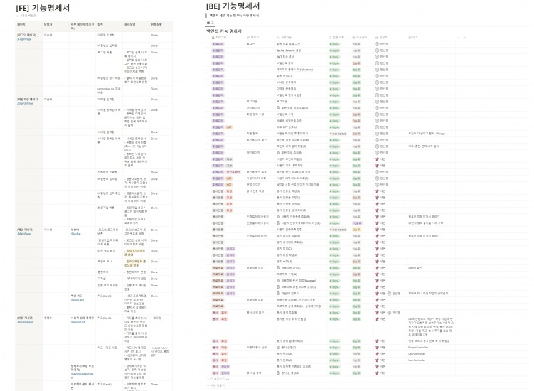
  

### API 설계
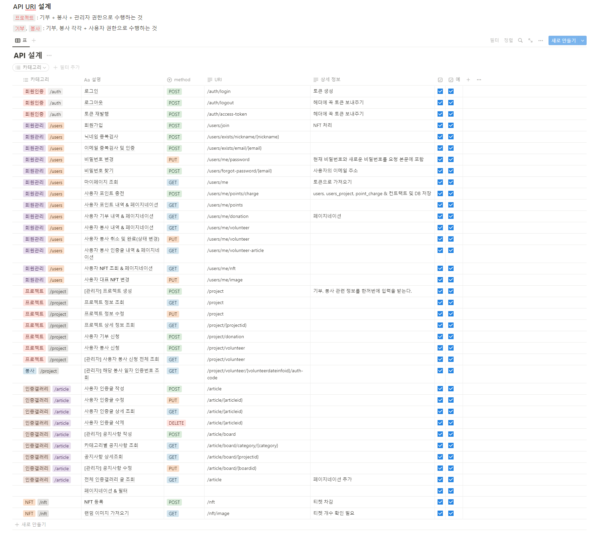
  

### 시스템 아키텍처
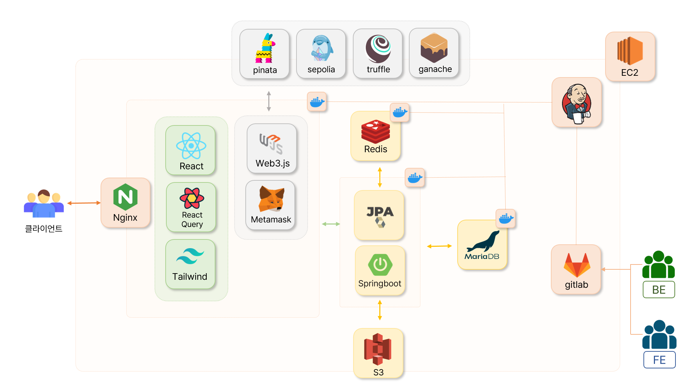
  

### 상세 디자인
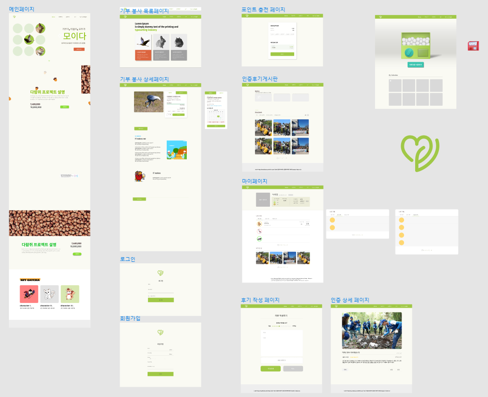

   
# 4. Blockchain & NFT 개념과 적용
## Blockchain
- 블록체인은 모든 네트워크 참여자에게 거래내역을 투명하게 공개하고, 여러 대의 노드에 이를 복제하여 저장하는 "분산형 데이터 저장기술"이다. P2P방식으로 중간 매개자의 필요성이 없고, 개인끼리의 직접 상호작용이 가능하다.
- 특징으로는 탈중앙화, 투명성, 보안성이 있다. 탈중앙화는 분산 네트워크 시스템을 사용하여 중간 매개자가 필요없는 점을, 투명성은 모든 구성원에게 거래 내역을 공개하는 점을 뜻한다. 각 블록은 해시로 연결되어 위변조가 불가능하기 때문에 보안성이 높다.
### 서비스 내 Fauset 흐름
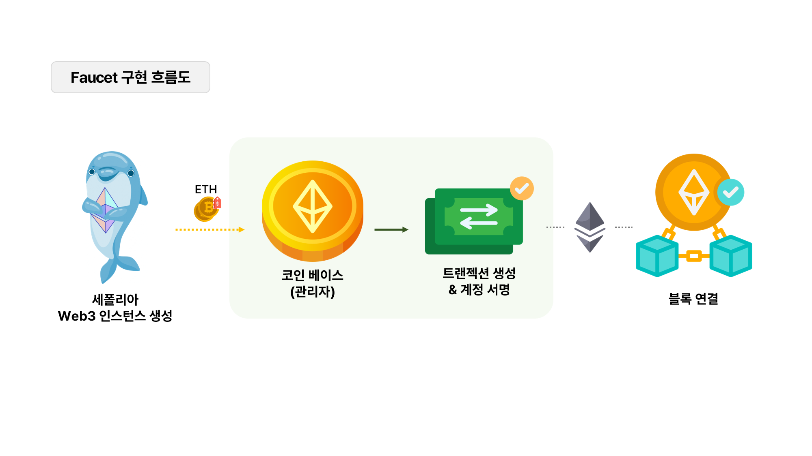
### 서비스 내 블록체인 흐름
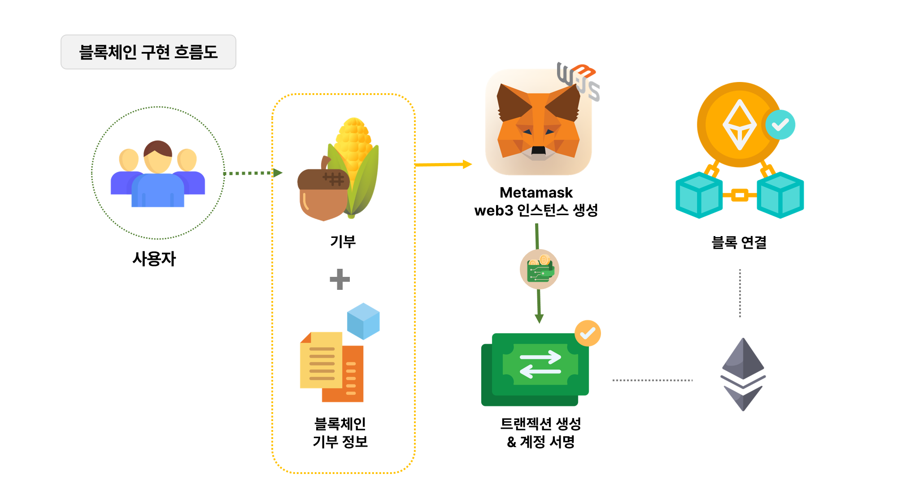
### 📹 [Blockchain 개념 정리 영상 바로가기](https://youtu.be/Elj-hhSfy0c)    
  

## NFT
- NFT는 대체 불가능 토큰(Non-fungible token), 블록체인 기술을 이용하여 디지털 자산의 소유주를 증명하는 방식이다. 
블록체인의 트랜젝션 해시와 메타데이터를 통해서 소유주를 증명할 수 있다.
트랜젝션은 거래에 대한 기록을, 메타데이터는 NFT에 대해 고유한 원본성과 소유권을 나타내는데 사용된다.
- NFT의 고유한 속성 값을 담고있는 JSON 데이터를 메타데이터라고 한다. 
보통 블록체인이 가진 저장공간 제약 때문에 이미지를 외부 저장소에 저장하고, URI만 가져다 쓰는 오프체인 방식으로 많이 저장한다.
이때 저장된 메타데이터를 볼 수 있도록 하는 외부 링크를 token URI라고 말한다.
NFT를 저장하는 외부 저장소로 IPFS를 주로 사용한다.
위 서비스는 외부 저장소로 Pinata라는 클라우드 서비스를 사용한다.
### 서비스 내 NFT 흐름
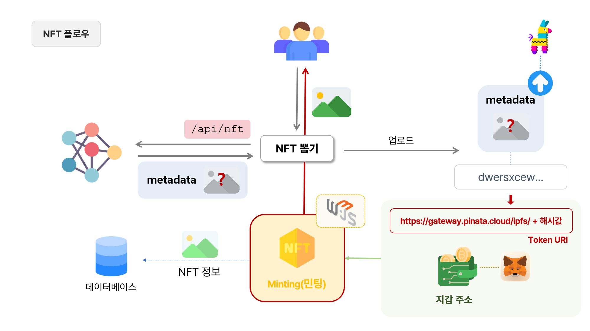  
### NFT 컬렉션
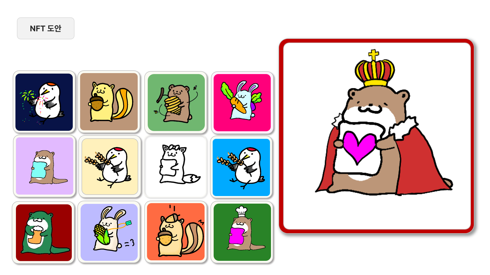
### 📹 [NFT 개념 정리 영상 바로가기](https://youtu.be/j9X3g9cgIuY)
   
      
# 5. 서비스 화면 (프로젝트 결과)
### 메인 페이지
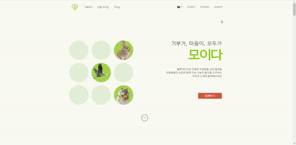

### 포인트 충전
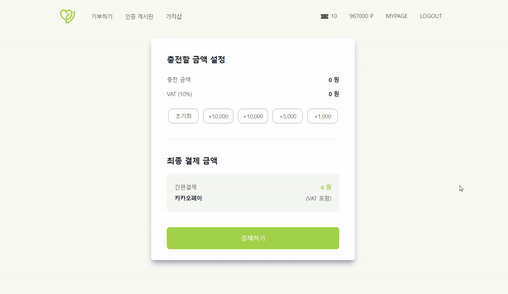

### 프로젝트 상세 조회
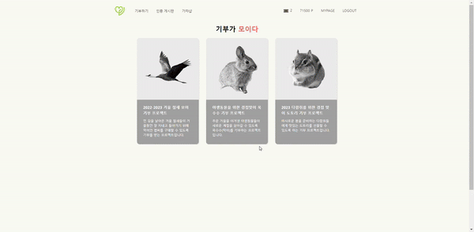

### 프로젝트 기부 신청
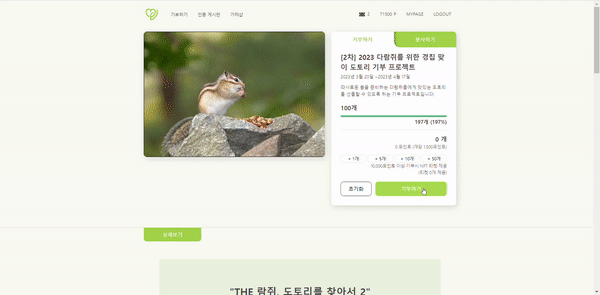

### 프로젝트 봉사 신청
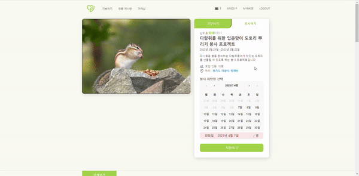

### 마이페이지 목록
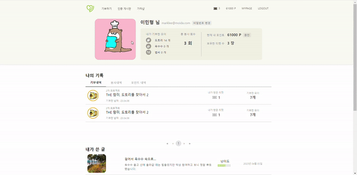

### 포인트 충전 내역
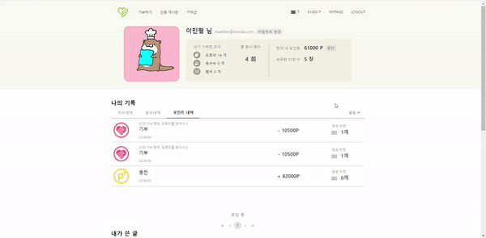

### 봉사 참석 인증
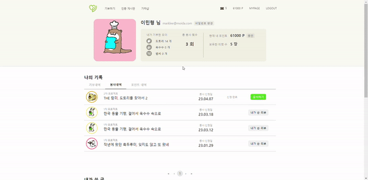

### 봉사 인증글 작성
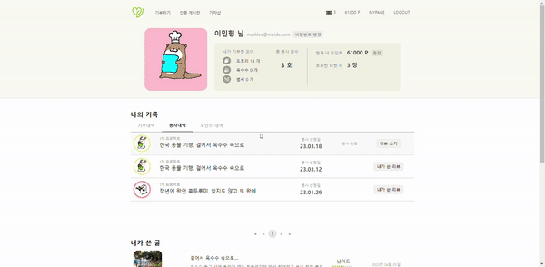

### 내 인증글 보기
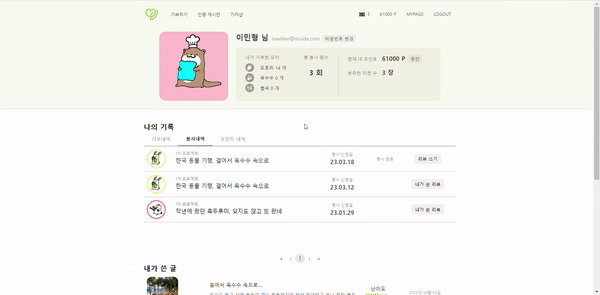
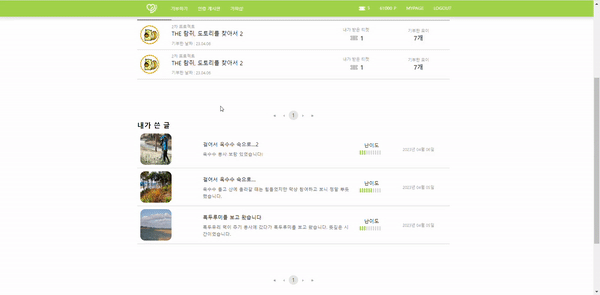

### 인증 게시판 - 사용자 인증 후기 목록
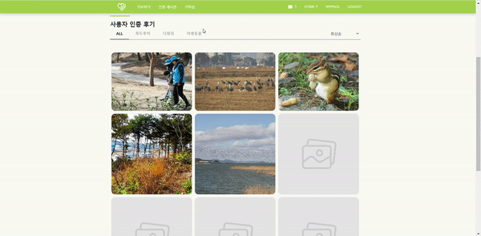

### 인증 게시판 - 인증글 상세 조회
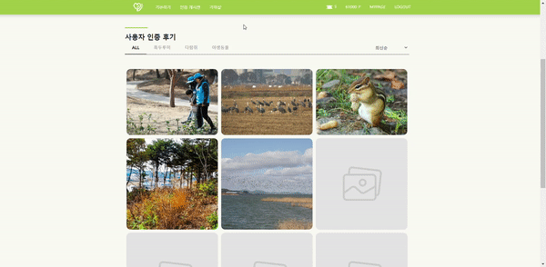

### 인증 게시판 - 공지사항
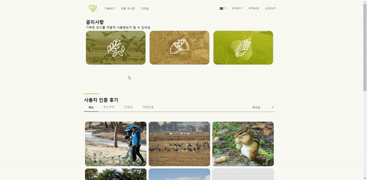

### NFT 가챠샵
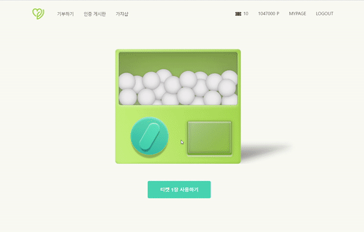

### 대표 NFT 변경
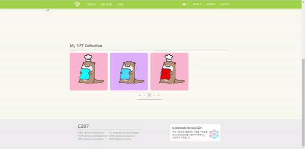

   
# 6. 협업 과정
### 협업 툴
- Git
- JIRA
- Notion
- MatterMost
  

### **Git 컨벤션**
### - Git branch
    - main  
    - develop  
    - feature     
### - feature 작성 방법
- feature/업무분야/기능설명  
- ex)  
    `feature/backend/user`  
    `feature/frontend/user`  
    `featrue/blockchain/donation`  
    `feature/nft/meanting`  
- MR 신청자 제외 같은 업무 분야에 있는 다른 사람이 MR 받기
### - commit message 작성 방법   
ex) `git commit -m "Feat: 회원가입 기능 추가"`   
   
|커밋유형|의미|
|----|---------------|
|FEAT|새로운 기능 추가|
|FIX|버그 수정|
|DOCS|문서 수정|
|STYLE|코드 포맷 변경, 간단한 수정, 코드 변경이 없는 경우|
|Design|CSS 등 사용자 UI 디자인 변경|
|Comment|필요한 주석 추가 및 변경|
|RENAME|파일 혹은 폴더명 수정 및 이동|
|REMOVE|파일 삭제|   

        
### **JIRA 컨벤션**
### - 작성 규칙
- Epic → Story → Task 
- 월요일 오전까지 그 주에 할 일들을 **백로그**에 **Task**로 모두 등록
- 매주 동일하게 등록해야할 사항은 **데일리 스크럼**
- ex)   
    > Epic : 프로젝트 기획   
    > Story : [기획]기획회의   
    > Task : [개인이모티콘][2주차]시장조사   
    ---
    > Epic : 프로젝트 개발   
    > Story : [개발]회원 관리 기능   
    > Task : [FE][개인이모티콘]로그인 페이지 구현 / [BE][개인이모티콘]로그인 기능 구현   

  

### Git Flow

  

### JIRA 번다운 차트
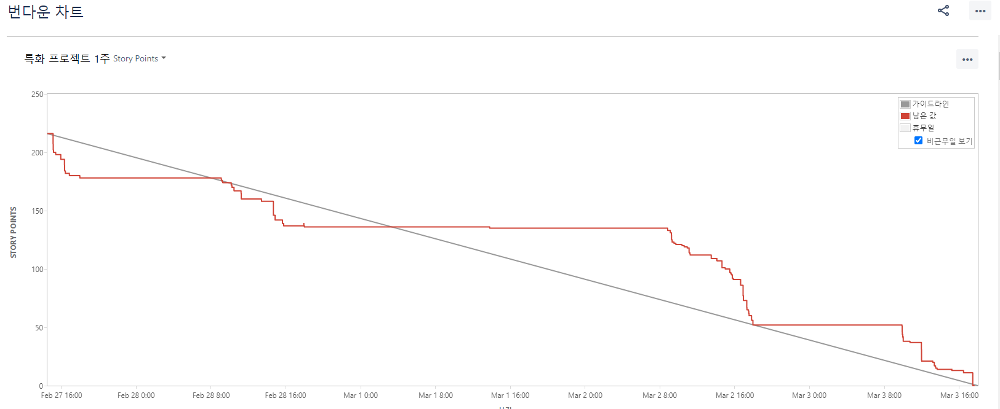
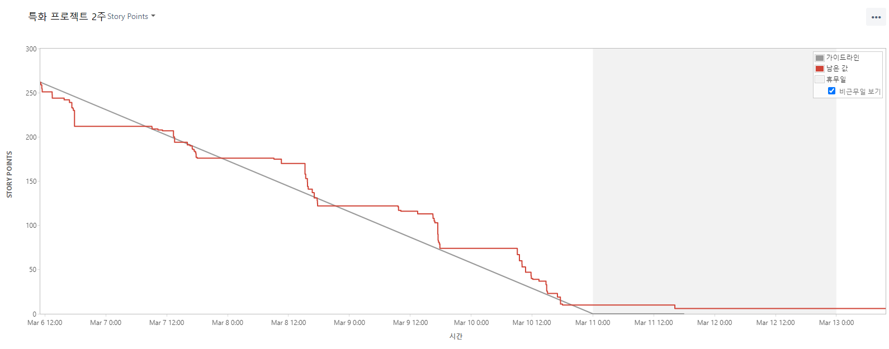
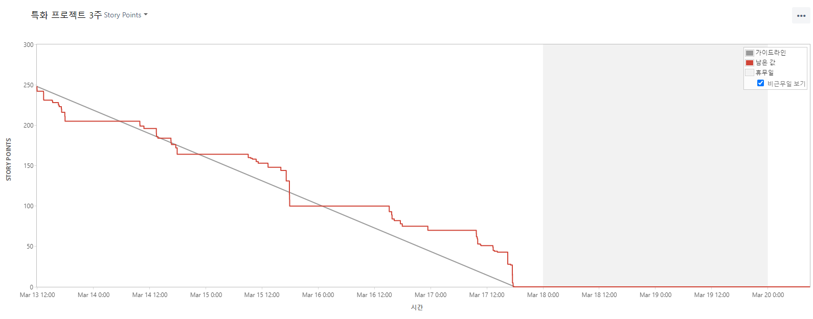
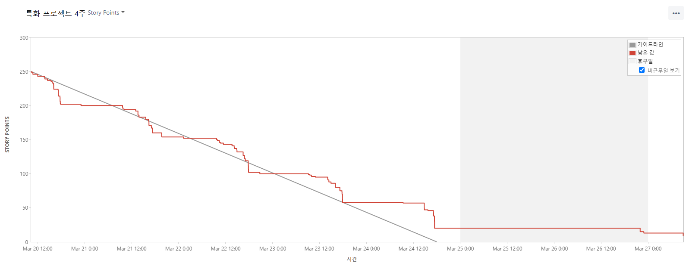
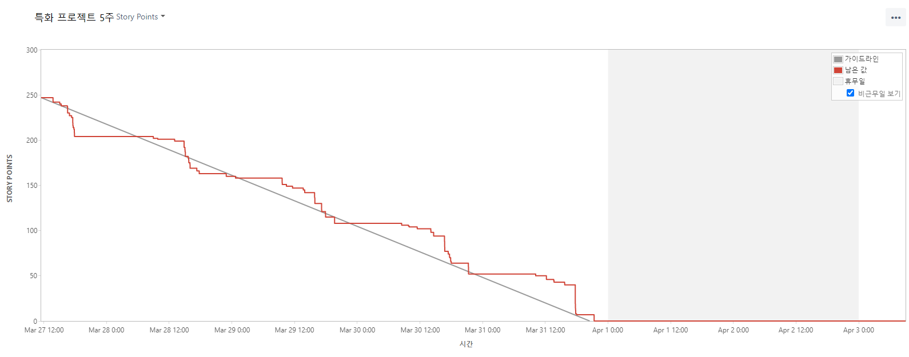

    
# 7. 지꿈지꿈 팀 소개
### 팀원 소개 및 담당 역할
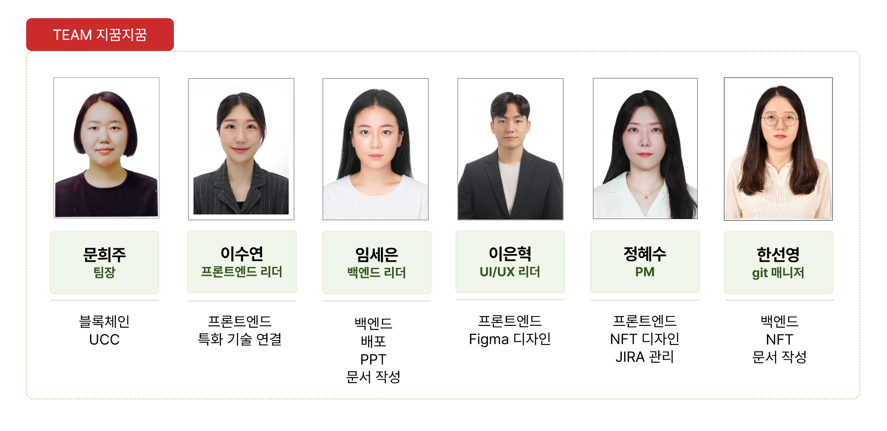
  

### 프로젝트 회고   
**문희주🐹**   
> 팀장의 무게 ,,, 처음으로 제대로 느꼈다 ,,, (전)팀장출신 혜수언니,,, 많은 도움 주셔서 감사합니다. 우리 NFT의 진정한 주인님,, 내 인생 꿈을 함께할 후보랄까 ,,,? :^) 옆에서 보조해준 우리 세은J씨,,, 덕분에 배포 걱정, 백엔드 걱정 하나도 안했구요 ㅎ 꼼꼼한 체크 항상 감사합니다:^) 나의 싸피 생활을 항상 함께 해주는 선영씨,,, 시큐리티 설정에,,, 리프레시 토큰에,,, 이거 완전 수푸링의 신이 되버리셨군요,,, 저 이제 함부로 반말 못하겠네요 ㅠㅅㅠ NFT ,,, 함께 해주셔서 정말정말정말 감사합니다 또 당신입니까,, 그저 goat 한.선.영. 다음 프젝도 잘 부탁한다구요 ? （＾∀＾●）ﾉｼ 나의 천사 수연언니,,, 제 못난 파편들을 예술로 승화시킨,,, 그 이름은 수연쓰;; 자바스크립트의 신인디;; 제가 말한 모든 걸 해주는 당신,,, 정말 미안하고,, ;ㅅ; 고맙읍니다,,, ;^) 은혁씨는 피그마 하느라 고생하셨습니다 ~ ^^ 블록체인 ,,, 믿고 맡겨주셨는데 생각보다 못한 것 같아서 다들 죄송하고,,, 못난 팀장과 함께 하느라 고생 많으셨습니다 ! 다음 자율 모두 잘 되시길 바라며... a-dios-
   
**이수연🎀**
> 이번 프로젝트에 프론트엔드에 블록체인 특화 기술을 연결하는 부분을 주로 담당했는데, 정말 많은 공부가 되었습니다. 협업하면서 기술 공유를 적극적으로 해주고 도와준 팀원들에게 진심으로 감사합니다!
> 블록체인 프로젝트이다보니, 어려울 것이라 예상하고 걱정을 했는데 성공적으로 마무리 할 수 있게 되어 기쁩니다. 새로운 기술에 대한 두려움을 없애고, 프론트엔드 개발에 재미를 더욱 찾게된 프로젝트였습니다. 즐겁게 프로젝트 할 수 있게 도와준 팀원들 모두 감사합니다~ !!!
   
**임세은🎅**
> 배포를 처음으로 맡게 되어서 많은 시행착오가 있었지만 좋은 경험이었습니다. 공통 프로젝트에 비해 백엔드에도 명확한 예외처리와 소통을 위한 swagger 작업에 시간을 쏟아 더욱 완성된 백엔드 코드를 작성할 수 있었습니다. 새로운 특화 기술과 서버, 프레임워크를 경험할 수 있었고 다양한 팀원을 만나면서 팀워크의 중요성을 깨달을 수 있었습니다. 2주간의 알찬 개발 경험이었습니다. 모두들 화이팅~
     
**이은혁🕶️**
> 리액트를 이번 프로젝트에서 처음 사용해보았다. 처음에는 낯설어 사용이 어려웠지만, 사용할 수록 생각한데로 동작이 이루어져 편리했다. 기존의 vue3에서 느꼈던 답답함이 속시원하게 사라지는 느낌이랄까..?!
> 프로젝트가 하루 남은 시점에 matter.js라는 물리엔진을 발견하여 급하게 애니메이션 이벤트를 작업하는 중이지만 이게 잘 될지는 모르겠다.
> 처음으로 스크롤 양을 측정해서 키프레임 애니메이션을 구현해보았는데, 생각보다 결과가 잘 나와서 아주 만족스럽다. 물론 스크롤 이벤트를 쉽게 구현해주는 다른 여러 라이브러리가 존재하지만, 배움의  기회라 생각하고 직접 자바스크립트로 구현했다. 보여준 사람들마다 다들 칭찬해줘서 기뻤다.
> **아무튼 이번 프로젝트 성공이다.**
   
**정혜수💙**
> 블록체인이라는 도메인과 리액트를 처음으로 접하는 프로젝트였습니다. 특화와 언어 공부, 기획, 설계, 개발, 발표까지 총 7주간의 프로젝트로 새롭게 배운 것이 많아 특히 알찼던 것 같습니다. 먼저 리액트 프레임워크는 다양한 라이브러리를 손쉽게 이용가능하다는 점과 뷰와는 달리 시점에 대한 고민을 많이 하지 않아도 된다는 점이 편리했습니다. 짧은 공부 시간에도 사용하기 편했던 언어였고, 그 외 확장성도 좋았습니다. 블록체인과 NFT 도메인은 어려운 기술인 만큼 구현해내기 어려웠던 것 같습니다.. 하지만 팀원들과 모두 열심히 노력한 끝에 첫번째 프로젝트에 비해 보다 빠르게 기획과 설계를 마칠 수 있었고 새로운 기술들도 비교적 빠르게 습득하여, 이번 프로젝트는 저번보다 몇 발자국 더 나아갈 수 있었다고 생각합니다. 개발과 기획 외에도 NFT 디자인, 발표, 지라 등 그 외의 다양한 업무들을 하면서 프로젝트가 더 풍성해진 것 같고, 야생동물 상생 플랫폼 모이다가 잘 마무리 되어 기쁩니다.
    
**한선영🌷** 
> 이번 특화 프로젝트를 통해 블록체인과 NFT에 대해 학습을 하고 적용할 수 있어서 좋은 경험이 되었다고 생각합니다. NFT 기능을 구현하기 위해 solidity와 web3등을 학습하면서 새로운 경험을 할 수 있었습니다. 또한 Spring Security 관련 filter나 인증&인가 오류 등 많은 공부를 하고 적용해볼 수 있어서 성장을 많이 할 수 있었습니다. 쉽지 않은 도메인이었지만 덕분에 많은 것을 배울 수 있는 프로젝트였습니다.

    
# 8. 프로젝트 관련 링크 모음
- 링크 추가하기

